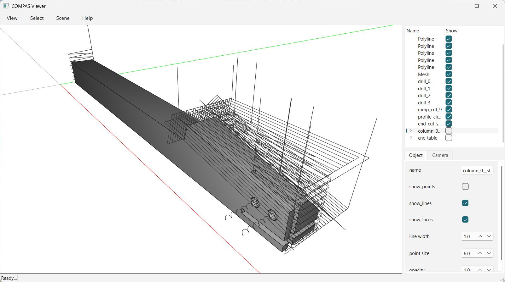

# COMPAS CNC

`compas_cnc` generates 2D CNC milling tool-paths and post-processes them to G-code,
built on the COMPAS framework.

## Tool-paths

Each generator returns one continuous tool-centre path that starts and ends at a
safe height, ready to be merged and post-processed:

- **`toolpath_2d_drill`** — helical drilling of round holes.
- **`toolpath_2d_ramp`** — ramp / slot plunging along an open or closed profile,
  with optional dogbone corner relief for inside corners.
- **`toolpath_2d_surfacing`** — zig-zag face clearing to level a surface.
- **`toolpath_2d_hatch`** — raster pocket fill that respects islands and supports
  layered roughing in successive depth passes.

`toolpath_merge` concatenates several tool-paths into a single ordered job, linking
them with safe rapid moves.

## Tools

- **`Tool`** describes the cutter (diameter, lengths, feeds) used to offset the
  cutting geometry and to draw the path for previewing in the COMPAS Viewer.
- **`Postprocessor`** turns the merged tool-path into machine G-code.

Cutting geometry is offset and hatched through a compiled Clipper2 wrapper
(`compas_cnc._clipper2`).
